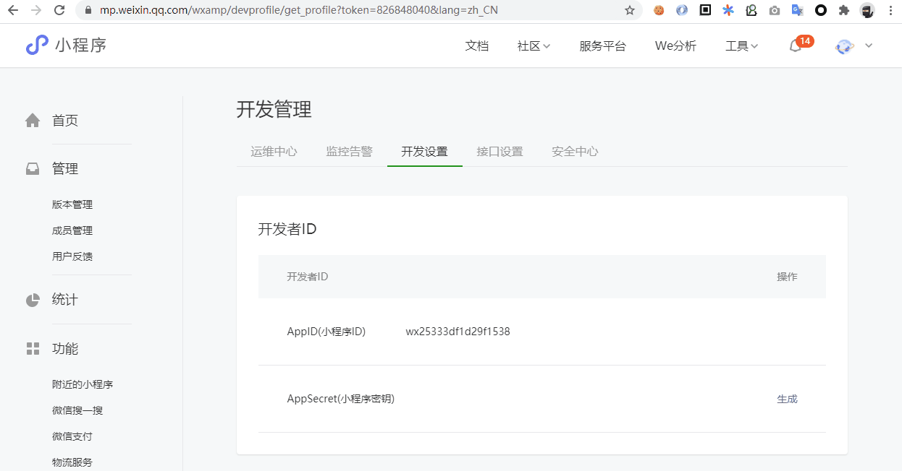

## YoTest-MiniProgram-SDK 文档

<a href="https://www.npmjs.com/package/yotest-miniprogram-sdk"></a>

> 基于虚拟机保护、设备特征识别和操作行为识别的新一代智能验证码，具备智能评分、抗 Headless、模拟伪装、针对恶意设备自动提升验证难度等多项安全措施，帮助开发者减少恶意攻击导致的数字资产损失，强力护航业务安全。

- [仓库入口](https://github.com/YoTest-team/YoTest-MiniProgram-SDK#%E4%BB%93%E5%BA%93%E5%85%A5%E5%8F%A3)
- [兼容性](https://github.com/YoTest-team/YoTest-MiniProgram-SDK#%E5%85%BC%E5%AE%B9%E6%80%A7)
- [安装](https://github.com/YoTest-team/YoTest-MiniProgram-SDK#%E5%AE%89%E8%A3%85)
- [预备工作（重要）](https://github.com/YoTest-team/YoTest-MiniProgram-SDK#%E9%A2%84%E5%A4%87%E5%B7%A5%E4%BD%9C%E9%87%8D%E8%A6%81)
- [快速开始](https://github.com/YoTest-team/YoTest-MiniProgram-SDK#%E5%BF%AB%E9%80%9F%E5%BC%80%E5%A7%8B)
- [API](https://github.com/YoTest-team/YoTest-MiniProgram-SDK#api)

### 仓库入口：

<a href="https://gitee.com/yo-test-team/yo-test-mini-program-sdk"></a>&nbsp;&nbsp;
<a href="https://github.com/YoTest-team/YoTest-MiniProgram-SDK"></a>

### 兼容性

- 小程序基础库 >= 1.6.4

### 安装

> npm install yotest-miniprogram-sdk --save

安装完成后，请点击微信开发者工具的导航菜单中的 `工具 -> 构建npm` 进行 node_modules 的构建。

### 预备工作（重要）

友验小程序SDK依赖了微信小程序的WebView组件的相关能力，因此若需要成功使用此SDK，需要提前满足三个能力：
- 小程序基础库 >= 1.6.4；
- 已绑定[业务域名](https://developers.weixin.qq.com/miniprogram/dev/framework/ability/domain.html)；
- [index.html](https://github.com/YoTest-team/YoTest-MiniProgram-SDK/blob/master/index.html)已放置在对应域名的URL路径之下，并且可以通过URL正常访问；

第一步，请确认自己的小程序基础库 >= 1.6.4，如图所示。


第二步，绑定业务域名，其步骤如下图所示，更为详细的步骤请参考[微信小程序官方文档](https://developers.weixin.qq.com/miniprogram/dev/framework/ability/domain.html)。



第三步，下载本项目的[index.html](https://github.com/YoTest-team/YoTest-MiniProgram-SDK/blob/master/index.html)，并将其上传到你项目所属的服务器、CDN或OSS服务上，若能通过绑定的 `业务域名` 正常访问，则预备工作完成^_^，接下来就可以顺利的进行SDK接入啦！


### 快速开始

第一步，使用 npm 安装友验小程序组件。

```shell
> npm init
> npm install yotest-miniprogram-sdk --save
```


第二步，通过微信开发者工具的导航菜单中的 `工具 -> 构建npm` 进行 node_modules 的构建。


第三步，在项目的 `app.json` 中引入友验小程序组件。

```javascript
{
  // ...
  "usingComponents": {
    "yotest": "./miniprogram_npm/yotest-miniprogram-sdk/yotest/yotest",
    "yotest-webview": "./miniprogram_npm/yotest-miniprogram-sdk/yotest-webview/yotest-webview"
  },
  // ...
}
```


第四步，创建验证页面，并引入 `yotest-webview` 组件，此处需要绑定微信小程序的 `业务域名`，请参考[预备工作（重要）](https://github.com/YoTest-team/YoTest-MiniProgram-SDK#%E9%A2%84%E5%A4%87%E5%B7%A5%E4%BD%9C%E9%87%8D%E8%A6%81)。

```html
<!-- pages/verify/verify.wxml -->
<!-- 此处加载的URL需要绑定业务域名，请参考文档中的预备工作 -->
<yotest-webview url="https://your.domain.com/index.html"></yotest-webview>
```


第五步，在业务页面引入 `yotest` 组件，并设置 `accessId`、`pageRoute`、`bindsuccess`、`binderror`等属性及回调函数。

```html
<!-- pages/index/index.wxml -->
<view class="container">
  <yotest
    id="captcha"
    accessId="your accessId"
    pageRoute="../verify/verify"
    bindsuccess="onVerifySuccessHandler"
    binderror="onVerifyErrorHandler"
  >
  </yotest>
  <button bindtap="onButtonTapHandler">开始验证</button>
</view>
```

在 JavaScript 文件中监听相关的成功或失败的事件，获取对应的验证凭证或错误信息。

```javascript
/** pages/index/index.js */
Page({
  onButtonTapHandler() {
    this.selectComponent("#captcha").verify();
  },
  onVerifySuccessHandler({ detail }) {
    // 验证成功，获取token及verified交给后端进行二次验证
    const { token, verified } = detail;
    console.log(">>>>>>>>>", token, verified);
  },
  onVerifyErrorHandler(event) {
    // 验证失败，获取错误码及信息
    const { code, message } = detail;
    console.log(">>>>>>>>>", code, message);
  },
});
```

### API

组件属性

- [accessId](https://github.com/YoTest-team/YoTest-MiniProgram-SDK#accessid-string)
- [pageRoute](https://github.com/YoTest-team/YoTest-MiniProgram-SDK#pageroute-string)
- [url](https://github.com/YoTest-team/YoTest-MiniProgram-SDK#url-string)

组件方法

- [verify](https://github.com/YoTest-team/YoTest-MiniProgram-SDK#verify)

组件事件

- [bindsuccess](https://github.com/YoTest-team/YoTest-MiniProgram-SDK#bindsuccess)
- [binderror](https://github.com/YoTest-team/YoTest-MiniProgram-SDK#binderror)

#### accessId \<String\>

必填，当前项目所属的 accessId，可以在友验后台中进行相关获取及查看（此属性仅支持 `yotest` 组件）。

```html
<yotest id="#captcha" 
        accessId="your accessId" 
        pageRoute="verify route in app.json"> 
</yotest>
```

#### pageRoute \<String\>

必填，`yotest-webview`组件所在 Page 的路径，请确保对应的 Page 在 `app.json` 中已被注册（此属性仅支持 `yotest` 组件）。

```html
<yotest id="#captcha" 
        accessId="your accessId" 
        pageRoute="verify route in app.json"> 
</yotest>
```

#### url \<String\>

必填，注册的域名对应的 HTML 地址，此域名需要在小程序后台进行 `业务域名` 绑定，域名绑定相关操作请参考[预备工作（重要）](https://github.com/YoTest-team/YoTest-MiniProgram-SDK#%E9%A2%84%E5%A4%87%E5%B7%A5%E4%BD%9C%E9%87%8D%E8%A6%81)，对应 HTML 内容请参考[index.html](https://github.com/YoTest-team/YoTest-MiniProgram-SDK/blob/master/index.html)（此属性仅支持 `yotest-webview` 组件）。

```html
<yotest-webview url="https://your.domain.com/index.html"></yotest>
```

#### verify()

- `return:` null

调用此 API 可以呼出验证界面并要求验证。

```html
<!-- index.wxml -->
<yotest id="#captcha" 
        accessId="your accessId" 
        pageRoute="verify route in app.json"> 
</yotest>
<button bindtap="onTapHandler">开始验证</button>
```

```javascript
/** index.js */
Page({
  onTapHandler() {
    this.selectComponent("#captcha").verify();
  },
});
```

#### bindsuccess

监听验证成功的事件。

```html
<!-- index.wxml -->
<yotest id="captcha"
        accessId="your accessId"
        pageRoute="../verify/verify"
        bindsuccess="onVerifySuccessHandler">
</yotest>
<button bindtap="onButtonTapHandler">开始验证</button>
```

```javascript
/** index.js */
Page({
  onButtonTapHandler() {
    this.selectComponent("#captcha").verify();
  },
  onVerifySuccessHandler({ detail }) {
    // 验证成功，获取token及verified交给后端进行二次验证
    const { token, verified } = detail;
    console.log(">>>>>>>>>", token, verified);
  },
});
```

#### binderror

监听验证错误的事件。

```html
<!-- index.wxml -->
<yotest id="captcha"
        accessId="your accessId"
        pageRoute="../verify/verify"
        binderror="onVerifyErrorHandler">
</yotest>
<button bindtap="onButtonTapHandler">开始验证</button>
```

```javascript
/** index.js */
Page({
  onButtonTapHandler() {
    this.selectComponent("#captcha").verify();
  },
  onVerifyErrorHandler(event) {
    // 验证失败，获取错误码及信息
    const { code, message } = detail;
    console.log(">>>>>>>>>", code, message);
  },
});
```
